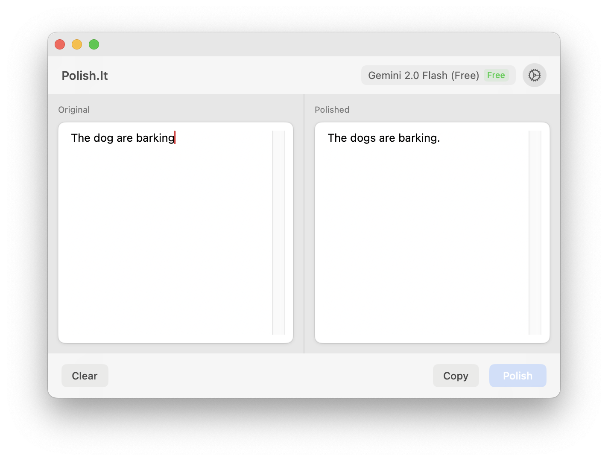
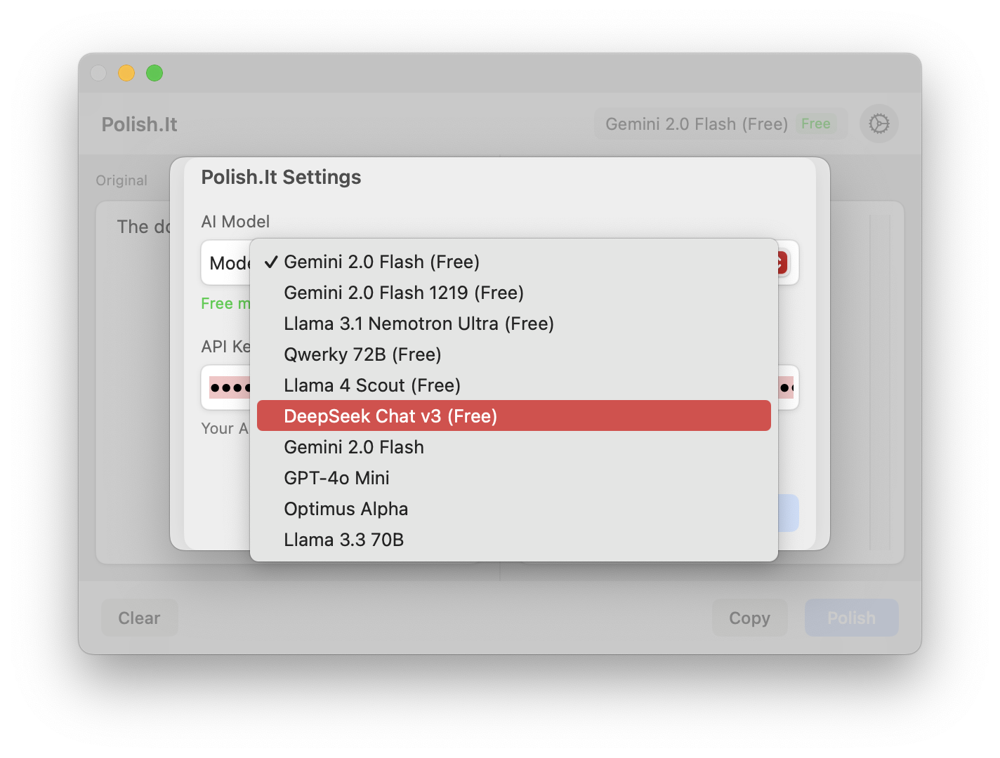

# Polish.It

  

**Polish.It** is a macOS application that helps you refine and enhance your text and code content.It uses advanced AI to help you communicate and manage code.

_Main content view_

_API settings view_

## Requirements

- macOS 11.5 or later
- Apple Silicon or Intel Mac

## Support

If you encounter any issues or have questions, please [open an issue](https://github.com/vincecao/polish-it/issues) on GitHub.

## License

This project is licensed under the MIT License - see the LICENSE file for details.